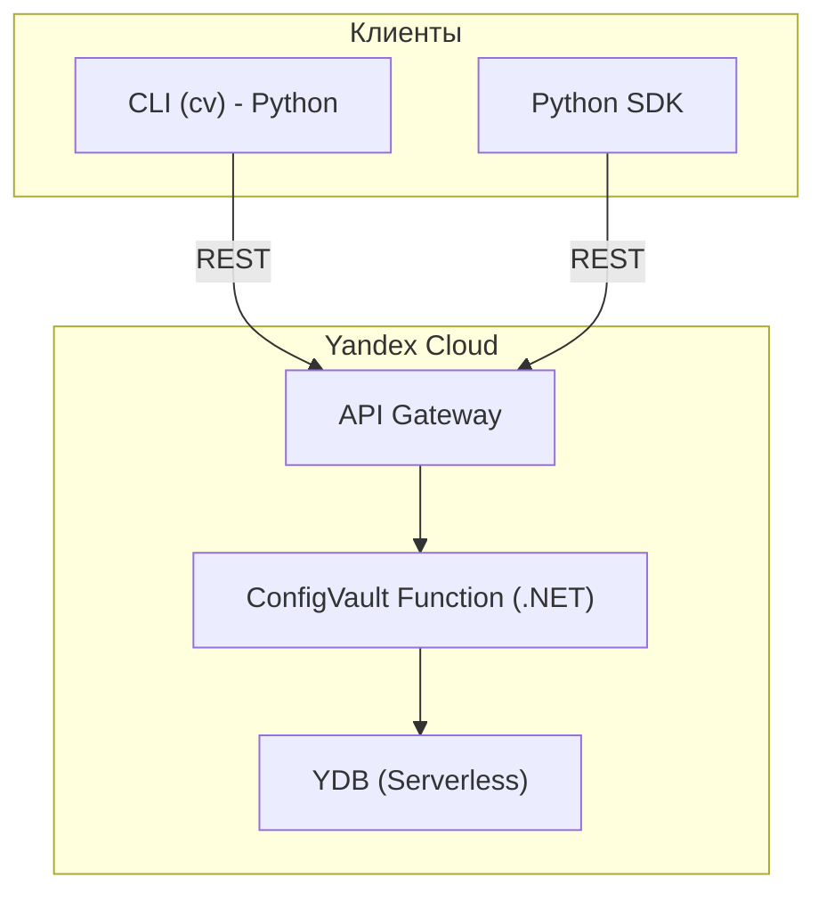
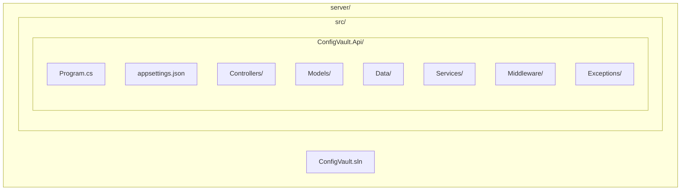
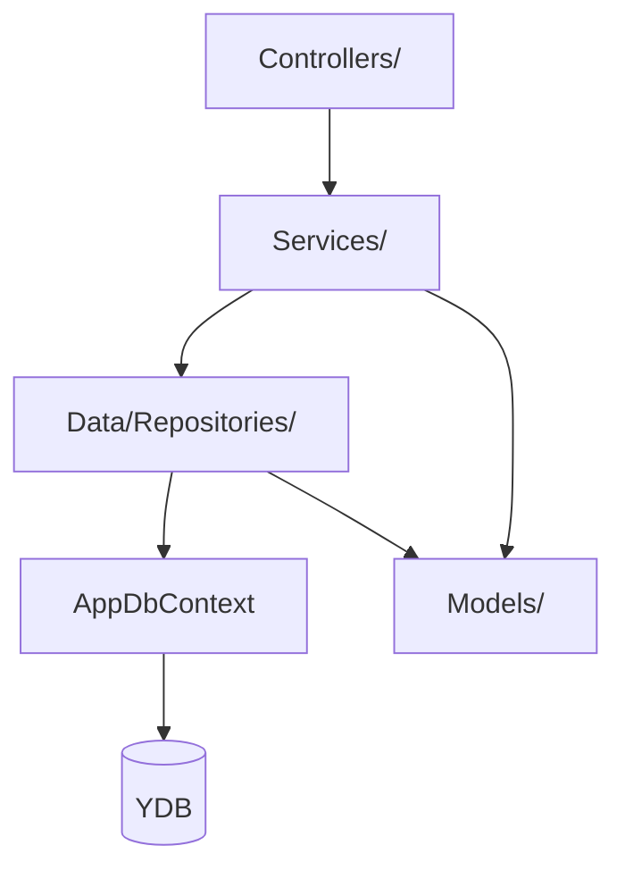
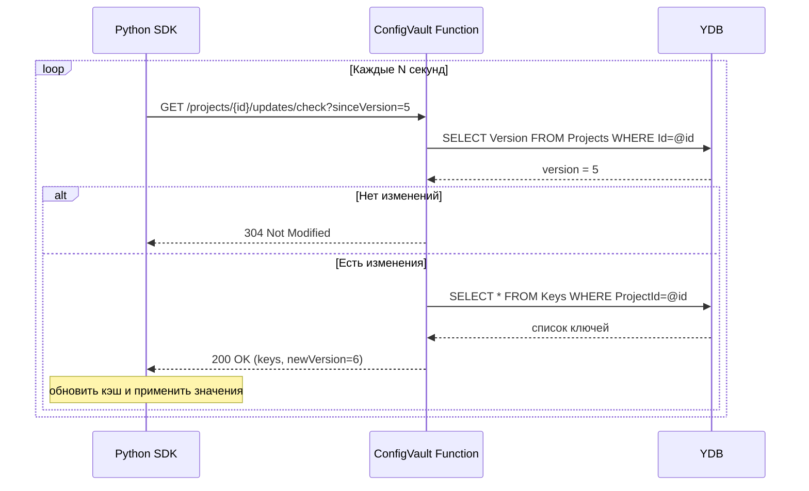

# Бэкенд ConfigVault (.NET)

## 1. Общие сведения

Бэкенд ConfigVault — это серверное приложение на **.NET 8**, реализованное как единственный проект **ASP.NET Core Web API**. Он предоставляет REST API для управления конфигурациями и секретами, а также endpoint для опроса изменений клиентами (long polling). Приложение разворачивается в виде **Yandex Cloud Functions** и взаимодействует с базой данных **YDB** (Serverless) через Entity Framework Core с провайдером `EntityFrameworkCore.Ydb`.

## 2. Архитектура проекта (Container View)

Высокоуровневая схема взаимодействия сервисов и внешних клиентов.

> Все запросы от CLI и SDK поступают на единый URL (API Gateway или напрямую Cloud Function). Функция обрабатывает их, обращается к YDB и сразу возвращает ответ.

## 3. Структура папок проекта
Решение содержит один проект ConfigVault.Api, внутри которого код организован по папкам согласно ответственности.

Детальная структура директорий и файлов:

    server/
        ├── ConfigVault.sln
        └── src/
            └── ConfigVault.Api/
                ├── ConfigVault.Api.csproj
                ├── Program.cs
                ├── appsettings.json
                ├── Controllers/
                │   ├── AuthController.cs
                │   ├── UsersController.cs
                │   ├── ProjectsController.cs
                │   ├── KeysController.cs
                │   └── UpdatesController.cs
                ├── Models/
                │   ├── User.cs
                │   ├── Project.cs
                │   ├── Key.cs
                │   ├── KeyHistory.cs
                │   ├── LoginRequest.cs
                │   └── KeyResponse.cs
                ├── Data/
                │   ├── AppDbContext.cs
                │   └── Repositories/
                │       ├── UserRepository.cs
                │       ├── ProjectRepository.cs
                │       ├── KeyRepository.cs
                │       └── AuditRepository.cs
                ├── Services/
                │   ├── UserService.cs
                │   ├── ProjectService.cs
                │   ├── KeyService.cs
                │   ├── EncryptionService.cs
                │   └── AuditService.cs
                ├── Middleware/
                │   └── ExceptionHandlingMiddleware.cs
                └── Exceptions/
                    ├── NotFoundException.cs
                    ├── AccessDeniedException.cs
                    └── ValidationException.cs

## 4. Основные компоненты и их взаимодействие
Компоненты общаются по принципу «сверху вниз»: контроллеры вызывают сервисы, сервисы работают с репозиториями, а репозитории обращаются к БД через AppDbContext.

### Контроллеры
Тонкий слой, отвечающий только за приём HTTP-запросов, вызов нужного сервиса и возврат ответа.

### Сервисы
Содержат бизнес-логику. Могут использовать другие сервисы. Например, KeyService зависит от EncryptionService, AuditService и IKeyRepository.

### Репозитории
Инкапсулируют доступ к данным. Каждый репозиторий инжектит AppDbContext и предоставляет методы вроде GetByIdAsync, AddAsync, Update.

### Модели
Классы предметной области (User, Project, Key, KeyHistory), а также DTO для запросов/ответов (LoginRequest, KeyResponse). Доменные модели используются репозиториями и сервисами, DTO — контроллерами.

## 5. Механизм опроса изменений (Client Polling)
Поскольку сервер не может инициировать подключение к клиентам (serverless), обновления доставляются через периодический опрос.

### Принцип работы

Каждый проект в БД имеет поле Version (int), которое увеличивается при любом изменении любого ключа.

Клиент (Python SDK) периодически вызывает опрашивает сервер

Сервер сравнивает переданную версию с текущей:

- Если совпадает — возвращает 304 Not Modified.

- Если нет — возвращает список всех ключей и новую версию.

Клиент обновляет кэш и запоминает новую версию.

### Диаграмма последовательности

## 6. Аутентификация и авторизация
JWT-токены. При логине (POST /api/auth/login) пользователь получает токен, подписанный секретным ключом из конфигурации. Токен содержит userId и роли.

Все защищённые эндпоинты требуют заголовок Authorization: Bearer <token>.

Авторизация на уровне проекта реализована через проверку роли в таблице UserProjects. Создан простой хелпер ProjectAuthorizationService, который инжектится в сервисы и проверяет, имеет ли текущий пользователь нужную роль в проекте.

## 7. Безопасность
Пароли хешируются (BCrypt) перед сохранением.

Все значения ключей (value_encrypted) шифруются мастер-ключом ENCRYPTION_KEY, который задаётся в переменной окружения функции.

Мастер-ключ никогда не сохраняется в БД и не логируется.

Секретные значения (is_secret = true) маскируются при отображении в API.

JWT-секрет также хранится в переменной окружения.

## 8. Особенности работы с YDB
Используется официальный провайдер EntityFrameworkCore.Ydb, работающий через PostgreSQL-совместимый протокол.

В качестве первичных ключей используются Guid, генерируемые на клиенте (чтобы избежать проблем с автоинкрементом в YDB).

Транзакции: SaveChangesAsync в рамках одного DbContext выполняет все изменения атомарно.

