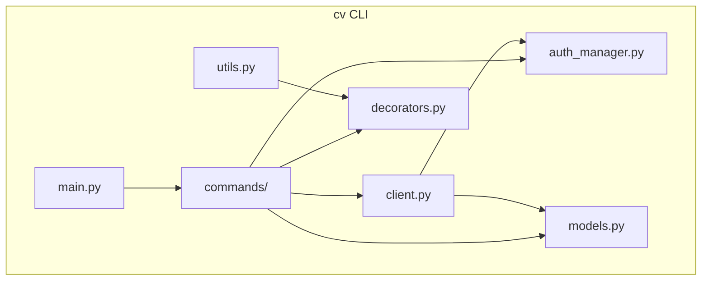
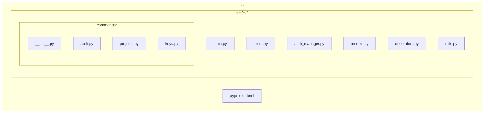
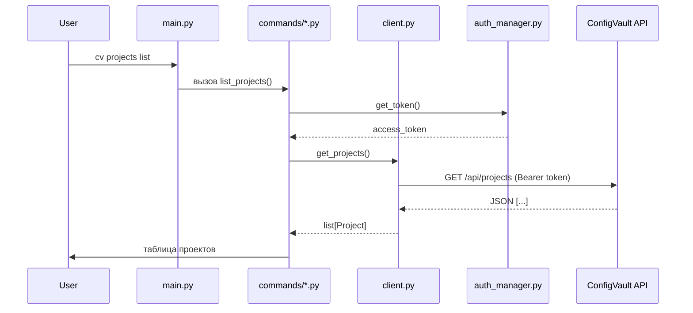

# CLI ConfigVault (`cv`)

## 1. Общие сведения

CLI ConfigVault (`cv`) — кроссплатформенная консольная утилита на Python, предназначенная для администрирования сервиса ConfigVault. Через неё можно управлять проектами и ключами, просматривать историю изменений, а также выполнять вход в систему.

CLI написан с использованием библиотеки `typer`, что обеспечивает удобный парсинг аргументов, автодокументацию и современный интерфейс командной строки.

**Ключевые особенности:**
- Асинхронный HTTP-клиент (`httpx`) для общения с REST API ConfigVault.
- Хранение токена доступа в локальном файле профиля (`~/.cvconfig`).
- Декораторы для проверки аутентификации и маскирования секретов.
- Возможность работы с несколькими профилями (серверами).
- Понятный цветной вывод с поддержкой маскирования секретных значений.
- Готовность к выделению модуля `client` в отдельную библиотеку для Python SDK.

---

## 2. Архитектура CLI

CLI-утилита состоит из нескольких функциональных блоков:

- **main.py** — точка входа, регистрирует подкоманды.
- **commands/** — реализации команд `auth`, `projects`, `keys`.
- **client.py** — асинхронный HTTP-клиент для взаимодействия с сервером.
- **auth_manager.py** — управление профилем и токеном доступа.
- **models.py** — датаклассы (Project, Key, User, DTO).
- **decorators.py** — `@require_auth`, `@mask_output`.
- **utils.py** — вспомогательные функции (цветной вывод, маскирование строк).

## 3. Структура папок и файлов

	cli/
	├── pyproject.toml
	└── src/
    └── cv/
        ├── __init__.py
        ├── main.py
        ├── client.py
        ├── auth_manager.py
        ├── models.py
        ├── decorators.py
        ├── utils.py
        ├── commands/
        │   ├── __init__.py
        │   ├── auth.py
        │   ├── projects.py
        │   └── keys.py

## 4. Основные компоненты

### 4.1. `main.py` — точка входа

Инициализирует главное приложение Typer, регистрирует подкоманды и глобальные опции.

### 4.2. `client.py` — асинхронный HTTP-клиент

Класс `VaultClient` отвечает за все запросы к ConfigVault API. Использует `httpx.AsyncClient` для неблокирующего взаимодействия.

**Основные методы:**

- `login(login, password)` → сохранение JWT.
- `get_projects()` → список проектов.
- `create_project(name)`.
- `delete_project(project_id)`.
- `get_keys(project_id)` → список ключей.
- `get_key(project_id, key_name)`.
- `set_key(project_id, key_name, value, is_secret)`.
- `delete_key(project_id, key_name)`.
- `get_key_history(project_id, key_name)`.
    
Все методы асинхронны, перед каждым запросом добавляется заголовок `Authorization: Bearer <токен>`.

### 4.3. `auth_manager.py` — управление токеном

Класс `AuthManager` работает с файлом профиля (по умолчанию `~/.cvconfig`). Хранит JSON-словарь с ключами:

- `server_url`
- `access_token`
- `login`

Методы:

- `get_token()` — возвращает текущий токен или `None`.
- `save_token(token)` — записывает токен в файл.
- `clear_token()` — удаляет токен (logout).
- `set_server(url)` — сохраняет URL сервера.

### 4.4. Команды (`commands/`)

Каждая группа команд — отдельный файл с объектом `typer.Typer`.

#### `auth.py`

- `login` — запрашивает логин/пароль, вызывает `client.login()`, сохраняет токен.
- `logout` — удаляет токен.
- `whoami` — показывает текущий логин и сервер.
    

#### `projects.py`

- `list` — выводит таблицу проектов.
- `create` — создаёт новый проект.
- `delete` — удаляет проект.
- `members add|remove|list` — управление участниками и их ролями.
    

#### `keys.py`

- `list` — показывает ключи проекта (с возможностью раскрыть секреты через `--reveal`).
- `get` — получить значение одного ключа.
- `set` — установить/обновить ключ (флаг `--secret` для пометки как секрет).
- `delete` — удалить ключ.
- `history` — показать историю изменений ключа.

### 4.5. Декораторы (`decorators.py`)

#### `@require_auth`
Проверяет наличие токена перед выполнением команды. Если токен отсутствует, выводит сообщение и завершает программу с кодом ошибки.

#### `@mask_output`
Обёртка для автоматического маскирования полей с секретами в выводе. Может принимать список ключей, значения которых нужно скрыть.

### 4.6. Модели (`models.py`)

Используются `dataclasses` для представления сущностей.
Также определены DTO для запросов (`LoginRequest`, `KeyCreateRequest`).

### 4.7. Утилиты (`utils.py`)

Функции для форматирования вывода:
- `mask(value: str) -> str` — заменяет секретное значение на `***`.
- `colorize(text, color)` — добавляет ANSI-цвета.
- `format_table(rows)` — печать таблицы с выравниванием.

## 5. Граф взаимодействия компонентов

