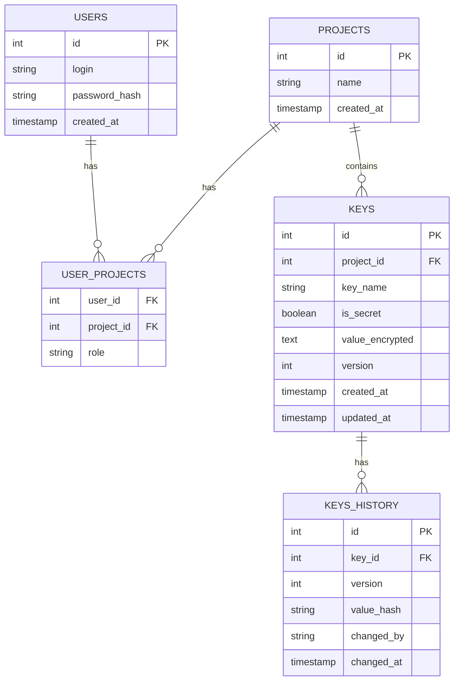

# Архитектура базы данных ConfigVault

## 1. Общее описание

База данных ConfigVault хранит всю информацию о пользователях, проектах, параметрах и истории их изменений. Она спроектирована для централизованного управления конфигурациями и секретами с поддержкой аудита и гибкого разграничения доступа.

## 2. ER-диаграмма

## 3. Описание таблиц

### 3.1. USERS — пользователи системы
Хранит учётные записи администраторов и разработчиков, которые управляют проектами и параметрами через CLI или SDK.

|Поле|Тип|Описание|
|----|-----|--------|
|id|int|Первичный ключ, уникальный идентификатор пользователя|
|login|string|Уникальный логин для входа|
|password_hash|string|Хэш пароля (bcrypt/scrypt)|
|created_at	|timestamp|Дата и время регистрации пользователя|

**Индексы:**

> PRIMARY KEY (id)

> UNIQUE (login) — для быстрого поиска при аутентификации

Пользователи не привязаны к организациям напрямую. Связь с проектами осуществляется через таблицу USER_PROJECTS, что даёт гибкость: один пользователь может иметь разные роли в разных проектах.

### 3.2. PROJECTS — проекты
Контейнеры для группировки параметров. Обычно один проект соответствует одному сервису или окружению.

|Поле	|Тип	|Описание|
|-------|-------|--------|
|id	|int|Первичный ключ|
|name|string|Уникальное название проекта|
|created_at|timestamp|Дата создания проекта|

**Индексы:**
> PRIMARY KEY (id)
> UNIQUE (name) — исключает дублирование имён

Проекты не хранят владельца напрямую. Владелец определяется через USER_PROJECTS с ролью owner. Один проект может иметь несколько владельцев.

### 3.3. USER_PROJECTS — связь пользователей с проектами
Реализует связь «многие ко многим» между пользователями и проектами с указанием роли, определяющей уровень доступа.

|Поле|	Тип|	Описание|
|----|-----|------------|
|user_id	|int	|Внешний ключ к USERS.id|
|project_id	|int	|Внешний ключ к PROJECTS.id|
|role	|string	|Роль пользователя в проекте: owner, editor, viewer|

> Составной первичный ключ: (user_id, project_id) — один пользователь может входить в проект только с одной ролью.

**Роли и их права:**

|Роль|Просмотр ключей|Изменение ключей|Управление участниками|Удаление проекта|
|----|---------------|----------------|----------------------|----------------|
|owner|	✓|✓|✓|✓|
|editor|✓|✓|✗|✗|
|viewer|✓|✗|✗|✗|

### 3.4. KEYS — параметры конфигурации
Содержит все конфигурационные параметры и секреты проекта. Каждое изменение значения обновляет запись (при этом инкрементируется version, перезаписывается value_encrypted).

|Поле|	Тип	|Описание|
|----|------|--------|
|id	|int|Первичный ключ|
|project_id|int|Внешний ключ к PROJECTS.id|
|key_name|string|Название параметра|
|is_secret|boolean|Флаг чувствительности данных (true = секрет)|
|value_encrypted|text|Зашифрованное значение параметра|
|version|int|Текущая версия значения (начинается с 1, увеличивается при каждом изменении)|
|created_at	|timestamp|Дата создания параметра|
|updated_at|timestamp|Дата последнего обновления значения|

**Индексы:**

> PRIMARY KEY (id)

> UNIQUE (project_id, key_name) — в одном проекте не может быть двух параметров с одинаковым ключом

> FOREIGN KEY (project_id) REFERENCES PROJECTS(id)

**Принцип хранения значений:**

- Все значения шифруются мастер-ключом сервера перед записью в БД, независимо от флага is_secret.

- Флаг is_secret влияет только на поведение после расшифровки:

    - Секретные значения маскируются при отображении.

    - Секретные значения не логируются сервером в открытом виде.

    - Публичные значения показываются полностью.

**Версионирование:**

При каждом обновлении значения

- Текущее значение (его хэш) сохраняется в KEYS_HISTORY со старой версией.

- version в KEYS инкрементируется.

- value_encrypted заменяется новым зашифрованным значением.

- updated_at обновляется.

### 3.5. KEYS_HISTORY — история изменений
Аудиторский лог всех изменений значений параметров. Позволяет отследить, кто, когда и как менял конфигурацию.

|Поле|Тип|Описание|
|----|---|--------|
|id	|int|Первичный ключ|
|key_id	|int|Внешний ключ к KEYS.id|
|version|int|Версия значения до изменения|
|value_hash|string|Хэш предыдущего значения для проверки целостности|
|changed_by|string|Логин пользователя внёсшего изменение|
|changed_at|timestamp|Дата и время изменения|
 
**Индексы:**

> PRIMARY KEY (id)

> FOREIGN KEY (key_id) REFERENCES KEYS(id)

## 4. Связи таблиц
1. > USERS ↔ USER_PROJECTS ↔ PROJECTS — многие ко многим с ролью.

2. > PROJECTS → KEYS — один ко многим: проект содержит множество ключей.

3. > KEYS → KEYS_HISTORY — один ко многим: у одного ключа много записей в истории.

## 5. Безопасность
Пароли хранятся только в виде хэшей.

Все значения параметров шифруются мастер-ключом. Мастер-ключ хранится в переменной окружения NET-сервера и никогда не попадает в БД.

Секретные значения (is_secret = true) маскируются в ответах API и не логируются.

Доступ к данным контролируется на уровне сервера через проверку роли пользователя в проекте (таблица USER_PROJECTS).
